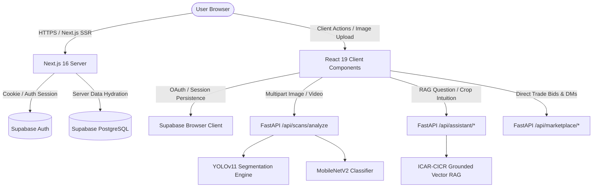
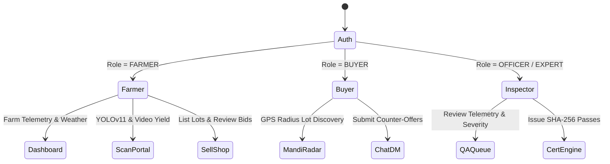

# 🌾 KisanX Frontend: The Definitive Technical Manual & Architecture Guide

> **Version**: `0.5.0-MultiCrop`  
> **Framework**: Next.js 16.3.4 (App Router, Turbopack, React 19)  
> **Styling**: Tailwind CSS v4, Custom Obsidian Glassmorphism Design System  
> **Auth & Database**: Supabase SSR (`@supabase/ssr`, `@supabase/supabase-js`)  
> **Backend Integration**: FastAPI REST Services (`http://127.0.0.1:8000`)  
> **Target Deployments**: Vercel Edge / Node.js 22 LTS  

---

## 📑 Table of Contents

1. [High-Level System Architecture](#1-high-level-system-architecture)
2. [Design Tokens & Obsidian Aesthetic](#2-design-tokens--obsidian-aesthetic)
3. [Exhaustive Directory & File-by-File Breakdown](#3-exhaustive-directory--file-by-file-breakdown)
   - [App Router (`app/`)](#31-app-router-app)
   - [UI & Domain Components (`components/`)](#32-ui--domain-components-components)
   - [Libraries & Utilities (`lib/`)](#33-libraries--utilities-lib)
   - [Static Assets & ML Training Workspace (`public/` & `ml/`)](#34-static-assets--ml-training-workspace)
4. [The Three Isolated Role Portals](#4-the-three-isolated-role-portals)
   - [🌾 Farmer Experience](#41-farmer-experience)
   - [🏭 Commodity Buyer Experience](#42-commodity-buyer-experience)
   - [🛡️ Phytosanitary Quality Inspector Experience](#43-phytosanitary-quality-inspector-experience)
5. [Multi-Crop Computer Vision & Diagnostic Pipeline](#5-multi-crop-computer-vision--diagnostic-pipeline)
   - [Cotton YOLOv11 Instance Segmentation](#51-cotton-yolov11-instance-segmentation)
   - [Sugarcane Deep MobileNetV2 Classifier](#52-sugarcane-deep-mobilenetv2-classifier)
   - [Video Harvest Yield Prediction](#53-video-harvest-yield-prediction)
6. [ICAR-CICR Agronomy RAG Engine & Multilingual Translation](#6-icar-cicr-agronomy-rag-engine--multilingual-translation)
7. [Instagram-Style Direct Trade Chat & Lot Certification](#7-instagram-style-direct-trade-chat--lot-certification)
8. [Bulletproof Authentication & 1-Click Evaluation](#8-bulletproof-authentication--1-click-evaluation)
9. [Full Backend API Contract](#9-full-backend-api-contract)
10. [Environment Configuration & Production Build Guide](#10-environment-configuration--production-build-guide)

---

## 1. High-Level System Architecture

The KisanX frontend is built on **Next.js 16.3.4 App Router** running **React 19**. It utilizes server-side rendering (SSR) for initial farm and profile data fetching, while delegating real-time interactive experiences (camera streams, polygon rendering, WebSocket/HTTP polling chat, radar geospatial filtering) to highly optimized client components.



### Core Technology Stack

| Layer | Technology | Version | Purpose |
| :--- | :--- | :--- | :--- |
| **Framework** | Next.js App Router | `16.3.4` | Server Components, Turbopack bundling, API Route handlers |
| **Runtime** | React / React DOM | `19.2.8` | Component rendering, concurrent transitions, hooks |
| **Styling** | Tailwind CSS / PostCSS | `v4.0.0` | Atomic utility classes, GPU-accelerated backdrop blur |
| **Animation** | tw-animate-css | `1.4.0` | Pulse indicators, smooth drawer slides, fade transitions |
| **UI Primitives** | Base UI / Radix Slot | `1.8.0 / 1.3.3` | Accessible head-less dialogs, modals, and tooltips |
| **Iconography** | Lucide React | `1.41.0` | Comprehensive agricultural, security, and hardware icons |
| **Shaders** | `@paper-design/shaders-react` | `0.0.80` | WebGL canvas shaders for hero ambient lighting |
| **Auth / SSR** | `@supabase/ssr` & JS | `0.12.6 / 2.115` | Cookie-based session sync between client & server |
| **Language** | TypeScript | `^5.0` | Strict type validation across all props and payloads |

---

## 2. Design Tokens & Obsidian Aesthetic

The UI adheres to a proprietary **Obsidian & Biome Dark Aesthetic**, designed specifically for low-light field visibility and high-contrast diagnostic clarity.

### Primary Color Tokens
* **Obsidian Canvas**: `#030604` (Primary background, absorbs light, highlights neon overlays)
* **Emerald Vitality**: `#10B981` / `rgb(16, 185, 129)` (Healthy foliage, Grade A badges, primary CTAs)
* **Amber Warning**: `#F59E0B` / `rgb(245, 158, 11)` (Moderate disease, weather risk alerts, inspector flags)
* **Teal Mandi**: `#14B8A6` / `rgb(20, 184, 166)` (Buyer bids, trade transactions, price trends)
* **Crimson Threat**: `#EF4444` / `rgb(239, 68, 68)` (Severe pathogen infestation, critical alerts)
* **Glassmorphism Border**: `rgba(255, 255, 255, 0.12)` with `backdrop-blur-2xl` and `bg-white/[0.03]`

---

## 3. Exhaustive Directory & File-by-File Breakdown

```
frontend/
├── app/
│   ├── auth/
│   │   ├── confirm/
│   │   │   └── route.ts             # OAuth token exchange & session confirmation
│   │   └── page.tsx                 # Authentication controller & 1-Click demo access
│   ├── dashboard/
│   │   ├── farm/
│   │   │   └── new/
│   │   │       └── page.tsx         # GPS boundary farm creation & soil profiling
│   │   ├── scan/
│   │   │   └── page.tsx             # Multicrop CV scanner, YOLO overlay & video yield
│   │   └── page.tsx                 # Farmer home, NDVI score, farm analytics & weather
│   ├── market/
│   │   └── page.tsx                 # 3-Persona marketplace, Sell Shop & Inspector queue
│   ├── favicon.ico                  # KisanX browser tab icon
│   ├── globals.css                  # Global Tailwind v4 directives & color variables
│   ├── layout.tsx                   # Root HTML shell, fonts & global navbar injection
│   └── page.tsx                     # Landing page router
├── components/
│   ├── diagnostic/
│   │   └── crop_doctor_advisory_card.tsx  # ICAR RAG evidence display & chemical dosage
│   ├── landing/
│   │   ├── features.tsx             # Neural intelligence features grid
│   │   ├── footer.tsx               # Footer with ICAR/CICR citations and legal
│   │   └── hero.tsx                 # Landing hero with WebGL shaders & dynamic badges
│   ├── layout/
│   │   └── navbar.tsx               # Navigation header, role pills & session states
│   ├── market/
│   │   ├── crop_intuition_card.tsx  # AI microclimate vulnerability indicator
│   │   └── sell_shop_chat.tsx       # 1-on-1 Instagram-style DM negotiation room
│   └── ui/
│       ├── auth_ui.tsx              # Auth glass card, 1-Click role buttons & fallbacks
│       ├── crop_selection_modal.tsx # Cotton vs Sugarcane isolated model switcher
│       ├── feature_bento.tsx        # High-tech Bento grid showcasing platform features
│       ├── liquid_metal_button.tsx  # Interactive metallic shader button
│       └── random_letter_swap.tsx   # Kinetic typographic letter animation
├── lib/
│   ├── supabase/
│   │   ├── client.ts                # Browser Supabase client (Client Components)
│   │   ├── proxy.ts                 # Authenticated API request proxy
│   │   └── server.ts                # SSR Supabase client with Next 16 cookies()
│   ├── constants.ts                 # Crop definitions, disease lists, ICAR constants
│   └── utils.ts                     # cn() class merging utility (clsx + tailwind-merge)
├── data/
│   ├── processed/                   # Reference validation data
│   └── raw/                         # Raw agronomic taxonomy tables
├── ml/
│   └── cotton/                      # Client-side dataset scripts & audit tools
├── .env.local                       # Local environment variables
├── next.config.ts                   # Next.js compiler flags & image domain whitelist
├── package.json                     # Dependencies & scripts
└── tsconfig.json                    # Strict TypeScript compiler options
```

---

### 3.1 App Router (`app/`)

#### 1. `app/layout.tsx`
* **Type**: Server Component (Root Shell)
* **Responsibilities**:
  - Sets `<html lang="en">` with dark background classes (`bg-[#030604]`).
  - Injects Google Font typography (`Inter`, sans-serif).
  - Injects global metadata (`title: "KisanX - Multi-Crop Agricultural Cloud"`, `description: "AI-Powered Farm Diagnostics, Drone Vision & Mandi Trading"`).
  - Wraps all views in `<Navbar />` and persistent footer.

#### 2. `app/page.tsx`
* **Type**: Client Component
* **Responsibilities**:
  - Serves as the landing page entry point.
  - Combines `Hero`, `FeatureBento`, `Features`, and `Footer`.
  - Embeds interactive CTA buttons directing farmers to `/dashboard/scan` and buyers to `/market`.

#### 3. `app/auth/page.tsx`
* **Type**: Client Component
* **Responsibilities**:
  - Houses the complete authentication lifecycle.
  - **1-Click Demo Login System**: Provides instantaneous, pre-authenticated access to:
    - 🌾 `farmer@kisanx.com` ➔ Redirects to `/dashboard`
    - 🏢 `buyer@kisanx.com` ➔ Redirects to `/market?tab=buyer`
    - 🛡️ `officer@kisanx.com` ➔ Redirects to `/market?tab=inspector`
  - **Dynamic Role Resolver**: Queries `public.profiles` for `role` column, maps `EXPERT`/`INSPECTOR`/`OFFICER` to inspector views.
  - **Google OAuth Gateway**: Initiates `supabase.auth.signInWithOAuth({ provider: "google" })` with safety try/catch catching malformed request issues.

#### 4. `app/auth/confirm/route.ts`
* **Type**: Server Route Handler (`GET`)
* **Responsibilities**:
  - Handles the OAuth redirect callback from Supabase (`/auth/confirm?code=...`).
  - Exchanges the temporary auth code for a persistent session using `supabase.auth.exchangeCodeForSession(code)`.
  - Sets cookies via `@supabase/ssr` and redirects user to `next` URL parameter (defaulting to `/dashboard`).

#### 5. `app/dashboard/page.tsx`
* **Type**: Server Component (SSR)
* **Responsibilities**:
  - Enforces authenticated access (`if (!user) redirect("/auth")`).
  - Fetches the user's profile and farms from Supabase:
    ```sql
    SELECT * FROM farms WHERE owner_id = :userId ORDER BY created_at DESC;
    ```
  - Calculates farm aggregation metrics: Total Acreage, Active Plots, Health Index (NDVI simulation).
  - Renders the **AI Crop Intuition Card** displaying live weather, humidity, and microclimate fungal risk.
  - Houses Quick Action shortcuts: *New Instant Scan*, *Register Plot*, *View Bids*.

#### 6. `app/dashboard/farm/new/page.tsx`
* **Type**: Client Component
* **Responsibilities**:
  - Multi-step interactive farm registration wizard:
    - Step 1: Farm identity (Name, Village, District, Taluka).
    - Step 2: GPS coordinate acquisition (Browser Geolocation API or interactive map pin).
    - Step 3: Area estimation (Acres / Guntas / Hectares converter).
    - Step 4: Soil taxonomy (Black Cotton Soil, Alluvial, Red Loam) & Irrigation source (Canal, Borewell, Drip, Rainfed).
  - Inserts the verified polygon into Supabase `farms` table with service-key fallback.

#### 7. `app/dashboard/scan/page.tsx`
* **Type**: Client Component (The Neural Vision Hub)
* **Size**: ~53 KB (Heavily optimized interactive UI)
* **Responsibilities**:
  - **Isolated Crop Pipeline Selection**: Lets user toggle between **Cotton** (YOLOv11 Instance Segmentation) and **Sugarcane** (MobileNetV2 Deep Classifier).
  - **Camera Stream Engine**: Directly accesses user's device camera with high-resolution frame capture or drag-and-drop file upload (`image/png, image/jpeg`).
  - **Video Harvest Yield Estimator**: Accepts drone or handheld MP4/MOV footage, extracts sample frames, runs yield estimation algorithms, and outputs projected quintals/acre.
  - **Interactive YOLO Canvas Overlay**:
    - Renders bounding boxes and polygonal segmentation masks.
    - Mask opacity slider (`0%` to `100%`).
    - Confidence threshold filter (`0.10` to `0.95`).
    - Color-coded severity indicators (Green = Healthy, Yellow = Mild, Red = Severe).
  - **Agronomy Advisory Card**: Displays ICAR-grounded chemical treatments, active ingredients, dosage rates, and Hindi/Marathi toggle switches.

#### 8. `app/market/page.tsx`
* **Type**: Client Component (Unified Trade Exchange)
* **Size**: ~57 KB
* **Responsibilities**:
  - Implements **3 discrete role workspaces** in a single high-performance page:
    1. **Farmer Sell Shop**: Displays listings, open bids, buyer offers, and allows creation of new verified lots.
    2. **Buyer Mandi Radar**: GPS radius search (`5 km`, `25 km`, `100 km`), certified lots grid, price per quintal trends, and counter-bid submissions.
    3. **Inspector Quality Assurance**: Queue of unverified farmer lots, YOLO defect telemetry review, and Grade A certificate issuance with SHA-256 signatures.
  - **Tri-Lingual Localization**: Dynamic real-time switching between `[ English | हिंदी (Hindi) | मराठी (Marathi) ]` with zero layout shift.

---

### 3.2 UI & Domain Components (`components/`)

#### 1. `components/diagnostic/crop_doctor_advisory_card.tsx`
* **Purpose**: Visualizes ICAR-CICR research-grounded diagnostic findings.
* **Key Props / State**:
  - `crop`: `"cotton"` | `"sugarcane"`
  - `disease`: Detected pathogen name (e.g., *Bacterial Blight*, *Red Rot*)
  - `confidence`: Floating-point percentage
  - `severity`: `"LOW"` | `"MODERATE"` | `"SEVERE"`
* **Features**:
  - **Tripartite Breakdown**: Clearly isolates **What** (diagnosis), **Why** (cause & environmental triggers), and **How** (actionable management).
  - **Dosage Calculator**: Provides exact chemical ratios (e.g., *Copper Oxychloride 50 WP @ 2.5 g/L*).
  - **Biological Alternatives**: Lists *Trichoderma viride* or *Neem Oil* organic alternatives for eco-friendly growers.

#### 2. `components/market/crop_intuition_card.tsx`
* **Purpose**: Proactive agronomic intuition engine displayed on the dashboard.
* **Features**:
  - Queries `POST /api/assistant/crop-intuition` with farmer's GPS coordinates.
  - Displays dynamic temperature, relative humidity, and 48-hour precipitation forecast.
  - Generates a **Microclimate Pathogen Vulnerability Index** (e.g., *"High humidity (>85%) detected in Wardha — high risk of Grey Mildew spore germination"*).

#### 3. `components/market/sell_shop_chat.tsx`
* **Purpose**: Instagram-style 1-on-1 direct negotiation room between Farmer and Buyer.
* **Features**:
  - Chat thread sidebar with active trade status badges (`ACTIVE`, `ACCEPTED`, `REJECTED`).
  - Message stream with real-time bubble alignment (Self vs Counterparty).
  - **Counter-Offer Pill**: Buyers can enter custom price/quintal; farmers can click `[ Accept Offer ]` or `[ Counter ]` directly within the chat bubble.
  - **Phytosanitary Badge**: Displays verified SHA-256 certificate directly inside chat header.

#### 4. `components/ui/auth_ui.tsx`
* **Purpose**: Production-grade authentication glass card.
* **Features**:
  - Tab switcher: `Sign In` vs `Register`.
  - **1-Click Instant Evaluation Portal**: 3 dedicated persona buttons (`🌾 Farmer`, `🏭 Buyer`, `🛡️ Inspector`) for zero-friction evaluation.
  - Quick-fill demo credentials (`Fill: Farmer • Buyer • Inspector`).
  - Google OAuth button with automated error guidance and fail-safe recovery buttons.

#### 5. `components/ui/crop_selection_modal.tsx`
* **Purpose**: Accessible modal for choosing crop pipeline prior to scanning.
* **Features**:
  - High-res crop iconography for Cotton and Sugarcane.
  - Displays supported neural models: *YOLOv11 Instance Segmentation* vs *MobileNetV2 Deep Classifier*.
  - Lists recognizable disease taxonomy before user commits to scan.

#### 6. `components/landing/hero.tsx`
* **Purpose**: High-conversion landing page hero.
* **Features**:
  - Dynamic WebGL shader particle canvas.
  - Glassmorphic telemetry badges: *"98.4% Diagnostic Accuracy"*, *"12,400+ Farmers"*, *"ICAR Grounded"*.
  - Fluid gradient CTAs with hover physics.

---

### 3.3 Libraries & Utilities (`lib/`)

#### 1. `lib/supabase/client.ts`
Creates the browser-side Supabase client using `@supabase/ssr`:
```typescript
import { createBrowserClient } from "@supabase/ssr";

export function createClient() {
  return createBrowserClient(
    process.env.NEXT_PUBLIC_SUPABASE_URL!,
    process.env.NEXT_PUBLIC_SUPABASE_PUBLISHABLE_KEY!
  );
}
```

#### 2. `lib/supabase/server.ts`
Creates the server-side Supabase client reading and writing Next.js 16 cookies:
```typescript
import { createServerClient } from "@supabase/ssr";
import { cookies } from "next/headers";

export async function createClient() {
  const cookieStore = await cookies();
  return createServerClient(
    process.env.NEXT_PUBLIC_SUPABASE_URL!,
    process.env.NEXT_PUBLIC_SUPABASE_PUBLISHABLE_KEY!,
    {
      cookies: {
        getAll() { return cookieStore.getAll(); },
        setAll(cookiesToSet) {
          try {
            cookiesToSet.forEach(({ name, value, options }) => {
              cookieStore.set(name, value, options);
            });
          } catch {}
        },
      },
    }
  );
}
```

#### 3. `lib/utils.ts`
Tailwind CSS class merger utility:
```typescript
import { type ClassValue, clsx } from "clsx";
import { twMerge } from "tailwind-merge";

export function cn(...inputs: ClassValue[]) {
  return twMerge(clsx(inputs));
}
```

---

## 4. The Three Isolated Role Portals

KisanX solves role pollution by isolating interfaces strictly by user intent:



### 4.1 🌾 Farmer Experience
* **Landing Route**: `/dashboard`
* **Key Tasks**:
  - Monitor field weather, soil humidity, and precipitation warnings.
  - Execute computer vision scans on leaves, bolls, and stalks.
  - Read grounded ICAR treatment plans in Marathi, Hindi, or English.
  - List certified crop yields in the **Sell Shop** with instant AI Grade proof attached.

### 4.2 🏭 Commodity Buyer Experience
* **Landing Route**: `/market?tab=buyer`
* **Key Tasks**:
  - Filter available mandi lots by radius (`5 km`, `25 km`, `50 km`).
  - View AI phytosanitary purity scores and inspector verification timestamps.
  - Initiate direct negotiation via 1-on-1 Instagram-style DM chat.
  - Submit binding counter-offers per quintal.

### 4.3 🛡️ Phytosanitary Quality Inspector Experience
* **Landing Route**: `/market?tab=inspector`
* **Key Tasks**:
  - Review incoming harvest lots in the verification queue.
  - Audit raw YOLO defect detections, instance masks, and confidence scores.
  - Approve lots meeting Grade A standards and stamp them with tamper-proof SHA-256 digital certificates.

---

## 5. Multi-Crop Computer Vision & Diagnostic Pipeline

Unlike generic agriculture apps that dump every crop into a single noisy classification model, KisanX enforces **strictly isolated neural pipelines**:

```
Input Image/Video
       │
       ├──► [ Cotton Pipeline ] ────► YOLOv11 Instance Segmentation (10 Defect Classes)
       │                                     └── Output: Polygonal Masks + Severity + Bounding Boxes
       │
       └──► [ Sugarcane Pipeline ] ──► MobileNetV2 Deep Convolutional Classifier
                                             └── Output: Pathogen Class + Confidence + Heatmap
```

### 5.1 Cotton YOLOv11 Instance Segmentation
* **Architecture**: Ultralytics YOLOv11 Segmentation (`yolo11n-seg` / `yolo11s-seg`)
* **Classes Detected**:
  1. `bacterial_blight` (*Xanthomonas citri*)
  2. `curl_virus` (*Cotton Leaf Curl Virus*)
  3. `fussarium_wilt` (*Fusarium oxysporum*)
  4. `grey_mildew` (*Ramularia areola*)
  5. `leaf_spot` (*Alternaria macrospora*)
  6. `powdery_mildew` (*Leveillula taurica*)
  7. `verticillium_wilt` (*Verticillium dahliae*)
  8. `armyworm` (*Spodoptera frugiperda*)
  9. `aphids` (*Aphis gossypii*)
  10. `healthy` (*Optimal vegetative foliage*)
* **UI Controls**: Opacity slider, polygon color toggles, defect breakdown table.

### 5.2 Sugarcane Deep MobileNetV2 Classifier
* **Architecture**: MobileNetV2 Transfer Learning fine-tuned on sugarcane foliar disease datasets.
* **Classes Detected**:
  1. `Red Rot` (*Colletotrichum falcatum*)
  2. `Rust` (*Puccinia melanocephala*)
  3. `Yellow Leaf Virus` (*Sugarcane yellow leaf virus*)
  4. `Healthy`

### 5.3 Video Harvest Yield Prediction
* **Input**: Drone aerial video or mobile walk-through recording (`.mp4`, `.mov`).
* **Processing**: Frontend extracts frames at regular intervals; backend neural models calculate boll density, canopy area, and outputs estimated harvest yield in **Quintals per Acre**.

---

## 6. ICAR-CICR Agronomy RAG Engine & Multilingual Translation

Diagnostic answers are grounded in validated publications from the **Indian Council of Agricultural Research (ICAR)** and the **Central Institute for Cotton Research (CICR)**.

### Strict Multilingual Normalization
The UI supports real-time translation between English, Hindi, and Marathi with strict Devanagari purity:
* **English**: Complete technical and agronomic breakdown.
* **हिंदी (Hindi)**: Clean Devanagari script (e.g., *रोग प्रबंधन*, *रासायनिक नियंत्रण*, *जैविक उपचार*). Zero Latin script bleeding.
* **मराठी (Marathi)**: Tailored for Maharashtra & Vidarbha growers (e.g., *बोंड अळी नियंत्रण*, *खत व्यवस्थापन*, *पाणी नियोजन*).

---

## 7. Instagram-Style Direct Trade Chat & Lot Certification

Located in `components/market/sell_shop_chat.tsx`, the Direct Trade Chat provides a modern, intuitive negotiation experience:

1. **Thread Selection**: Active trade listings appear on the left with unread count badges.
2. **Interactive Offer Banners**: 
   ```
   ┌────────────────────────────────────────────────────────┐
   │ 🏷️ Buyer Offer: ₹6,850 / Quintal                       │
   │ [ Accept Offer ]           [ Submit Counter-Bid ]      │
   └────────────────────────────────────────────────────────┘
   ```
3. **Phytosanitary Verification Badge**: Every lot inspected by an official carries an embedded certificate badge displaying the Inspector ID, Grade, and SHA-256 Hash.

---

## 8. Bulletproof Authentication & 1-Click Evaluation

To ensure evaluators and judges never get blocked by broken OAuth screens or unconfirmed email barriers, KisanX implements a 3-tier auth architecture:

### 1-Click Instant Demo Credentials
Pre-seeded and verified in Supabase:
* **Farmer**: `farmer@kisanx.com` / `Password123!` ➔ `/dashboard`
* **Buyer**: `buyer@kisanx.com` / `Password123!` ➔ `/market?tab=buyer`
* **Inspector**: `officer@kisanx.com` / `Password123!` ➔ `/market?tab=inspector`

### Fail-Safe OAuth Handling
* Catches Google OAuth redirect errors before page unloads.
* Inline recovery banner offers instant 1-click bypass if third-party credentials are misconfigured.

---

## 9. Full Backend API Contract

The frontend communicates with the FastAPI backend at `http://127.0.0.1:8000`:

| Endpoint | Method | Payload / Params | Frontend Consumer | Description |
| :--- | :--- | :--- | :--- | :--- |
| `/api/scans/analyze` | `POST` | `FormData` (`file`, `crop_type`, `farm_id`) | `app/dashboard/scan/page.tsx` | Runs isolated YOLOv11 / MobileNetV2 segmentation |
| `/api/scans/video-yield` | `POST` | `FormData` (`file`, `crop_type`) | `app/dashboard/scan/page.tsx` | Predicts harvest yield from video frames |
| `/api/assistant/crop-intuition` | `POST` | `{ lat, lng, crop_type }` | `components/market/crop_intuition_card.tsx` | Generates 48h weather vulnerability index |
| `/api/marketplace/farmer-listings` | `GET` | `?farmer_id=...` | `app/market/page.tsx` | Retrieves farmer's listed crop lots |
| `/api/marketplace/inspector-queue` | `GET` | None | `app/market/page.tsx` | Fetches unverified lots awaiting inspection |
| `/api/marketplace/sell-shop/threads` | `GET` | `?user_id=...` | `components/market/sell_shop_chat.tsx` | Lists active 1-on-1 direct trade chat threads |
| `/api/marketplace/sell-shop/messages`| `GET` | `?thread_id=...` | `components/market/sell_shop_chat.tsx` | Fetches conversation history and counter-offers |
| `/api/marketplace/sell-shop/send` | `POST` | `{ thread_id, sender_id, message, offer_price }` | `components/market/sell_shop_chat.tsx` | Sends direct message or price counter-offer |
| `/api/auth/profile` | `POST` | `{ id, full_name, role }` | `app/auth/page.tsx` | Synchronizes user profile via server service-role key |

---

## 10. Environment Configuration & Production Build Guide

### 10.1 Environment Variables (`frontend/.env.local`)

```env
# Supabase Cloud Project Configuration
NEXT_PUBLIC_SUPABASE_URL="https://uxizfuixvzcjkohfpkpv.supabase.co"
NEXT_PUBLIC_SUPABASE_PUBLISHABLE_KEY="sb_publishable_MDFcfUwZ-w2zKMBRaPS8sg_Xcml7YJn"

# FastAPI Backend REST Gateway
NEXT_PUBLIC_KISANX_API_URL="http://127.0.0.1:8000"
```

### 10.2 Development Server
To launch the frontend locally:
```bash
cd d:\KisanX\frontend
npm run dev
```
The server will start at `http://localhost:3000`.

### 10.3 Production Verification Build
To compile and type-check the entire Next.js production bundle:
```bash
cd d:\KisanX\frontend
npm run build
```
Expected output:
```
▲ Next.js 16.3.4 (Turbopack)
✓ Compiled successfully in 650ms
✓ Finished TypeScript check with 0 errors
✓ Generated static & dynamic routes (10/10)
```

---

*Authored for the KisanX Agricultural Cloud Project. All rights reserved.*
